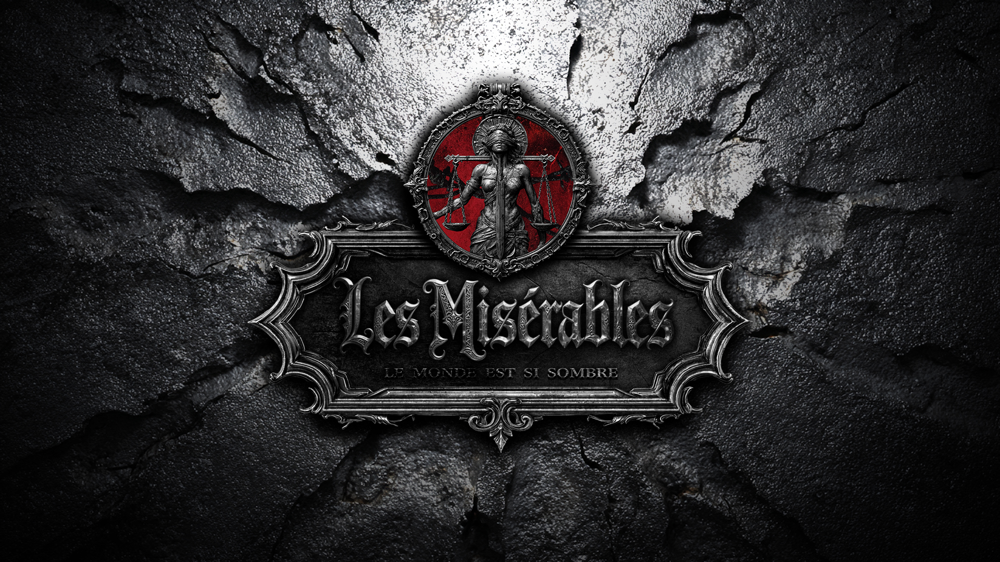

# 悲惨世界 / LesMiserablesMod

*Project banner / 项目横幅*

LesMiserablesMod is a public development organization for our Hearts of Iron IV mod projects.

LesMiserablesMod 是我们用于开发《钢铁雄心 IV》MOD 项目的公开组织页。

## About / 项目简介

We are building a Hearts of Iron IV alternate history mod set in the world of *A Miserable World*.

Based on the project team's own chronology and worldbuilding, this timeline diverges from the French Revolution and develops into a very different twentieth century: the Holy Roman Empire survives, China becomes a constitutional empire under Yuan Shikai in 1905, and the political order of Europe and Asia enters the late 1920s under a very different balance of power.

The game starts in **1929**, at a moment when the old order is still standing, but rival empires, reform movements, regional conflicts, and unresolved ideological struggles are pushing the world toward a new crisis.

我们正在制作一个以《悲惨世界》架空历史时间线为背景的《钢铁雄心 IV》MOD。

根据项目组构建的编年史设定与世界观内容，这条时间线自法国大革命开始偏离现实历史，并在二十世纪形成了完全不同的世界格局：神圣罗马帝国得以延续，袁世凯于 1905 年建立中华帝国并推行君主立宪，欧亚大陆的政治秩序也在此后走向了不同的发展道路。

游戏开局时间为 **1929 年**。此时旧秩序仍未彻底瓦解，但各大帝国、改革派、地方势力与不同意识形态之间的矛盾已经不断积累，新的世界危机正在逼近。

## World Overview / 世界观概览

- A divergent world shaped by the aftermath of the French Revolution
- A surviving Holy Roman Empire and a reshaped European order
- The establishment of the Chinese Empire in 1905 and its consolidation after the 1920s conflicts
- Competing empires, regional rivalries, constitutional experiments, and long-running colonial tensions

- 一个从法国大革命后走向分歧的架空世界
- 一个延续下来的神圣罗马帝国，以及被重塑的欧洲秩序
- 1905 年建立的中华帝国，以及其在 1920 年代冲突后的进一步整合
- 帝国竞争、地区对抗、立宪实验与长期殖民矛盾并存的全球局势

*Worldbuilding visual / 世界观氛围展示*

## Community Channels / 反馈与讨论

Please use the right channel so we can respond more efficiently:

- [Issues](https://github.com/LesMiserablesMod/.github/issues): bug reports, crashes, broken events, scripted logic problems, compatibility problems, and other concrete issues
- [Discussions](https://github.com/orgs/LesMiserablesMod/discussions): gameplay ideas, lore discussion, balance suggestions, modding questions, and general community talk

Before posting, please check whether the same issue or topic already exists.

请尽量按类型使用对应入口，方便我们处理和归档：

- [Issues](https://github.com/LesMiserablesMod/.github/issues)：用于 Bug 反馈、崩溃、事件脚本错误、逻辑错误、兼容性问题等明确问题
- [Discussions](https://github.com/orgs/LesMiserablesMod/discussions)：用于玩法建议、世界观与设定讨论、平衡性意见、MOD 制作交流和一般社区讨论

发帖前请先检查是否已有重复内容。

## Contributors Welcome / 欢迎贡献

We welcome help from:

- Scripters for events, effects, and focus trees
- Writers, editors, and translators for localization
- GFX artists for icons, portraits, and other assets
- Playtesters who can provide clear bug reports and balance feedback
- Researchers and designers interested in alternate history and regional content

Small contributions are welcome. Even one bug report, one icon, or one event fix is valuable.

我们欢迎以下方向的协作：

- 事件、效果和国策树脚本开发
- 本地化撰写、润色与翻译
- 图标、肖像和其他资源制作
- 愿意提供清晰反馈的测试者
- 对架空历史、地区内容和玩法设计感兴趣的研究与设计协作者

即使只是一次小型贡献也很有价值，比如一个 bug 反馈、一张图标或一个事件修复。

## Repositories / 仓库导航

Featured repositories and project links will be listed here as the organization grows.

随着组织内容逐步整理，我们会在这里放出主要仓库和项目导航链接。

*Recruitment / 招募信息：we are looking for planning, art, and development contributors. If you want to join or ask about collaboration, please contact us via QQ or Bilibili.*

*招募说明：我们目前招募策划、美术与开发成员。如希望参与项目，或想进一步了解协作方式，请通过 QQ 或 B 站联系我们。*
