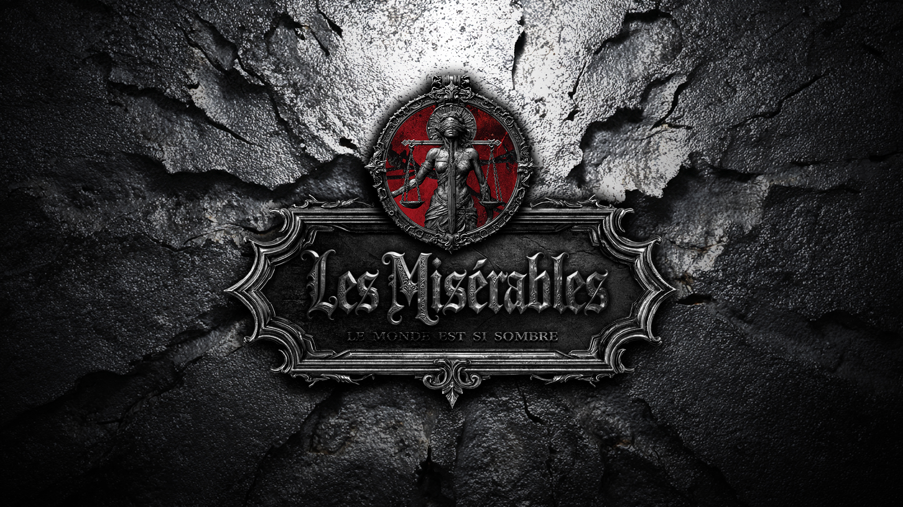

# 悲惨世界 / LesMiserablesMod

**一个始于 1929 年的《钢铁雄心 IV》架空历史 MOD，以及围绕大型 MOD 开发建设的开源工具与资料。**

**A Hearts of Iron IV alternate-history mod beginning in 1929, together with open-source tools and resources for large-scale mod development.**

## 项目简介 / About

LesMiserablesMod 是《悲惨世界》架空历史 MOD 的开发组织。这里既承载项目协作，也维护面向 HOI4 Modder 的编辑器、开发工具与参考资料。

本世界线自法国大革命后逐渐偏离现实历史：神圣罗马帝国仍然延续，袁世凯于 1905 年建立中华帝国并推行君主立宪。游戏开局时间为 **1929 年**——旧秩序尚未倒塌，但帝国竞争、改革运动、地区冲突与意识形态矛盾正在把世界推向新的危机。

LesMiserablesMod is the development organization behind the *Les Misérables* alternate-history mod. The timeline diverges after the French Revolution: the Holy Roman Empire survives, a constitutional Chinese Empire is established in 1905, and the game opens in **1929**, as competing empires, reform movements, regional conflicts, and ideological struggles push the old order toward a new crisis.

## 项目导航 / Projects

| 项目 / Project | 简介 / Description | 入口 / Links |
| --- | --- | --- |
| **HOI4 Modding Tools** | 双语 HOI4 制作工具、参考资料与工作流目录。 Bilingual catalog of HOI4 modding tools, references, and workflows. | [仓库 / Repository](https://github.com/LesMiserablesMod/hoi4-modding-tools) · [文档 / Docs](https://lesmiserablesmod.github.io/hoi4-modding-tools/) |
| **HOI4 Mod Utilities** | 面向 VS Code 的 HOI4 开发扩展，提供地图、国策树、科技树、事件、GUI 与 GFX 等预览功能。 A VS Code extension for HOI4 map, focus tree, technology, event, GUI, and GFX previews. | [原作者仓库 / Original Repository](https://github.com/herbix/hoi4modutilities) |
| **HOI4 Focus Tree Designer** | 浏览器端国策树设计器，支持前置与互斥关系、校验以及 TXT/YML 导入导出。 Browser-based focus tree editor with relationship modeling, validation, and TXT/YML import and export. | [仓库 / Repository](https://github.com/LesMiserablesMod/hoi4-focus-tree-designer) · [在线使用 / Web app](https://lesmiserablesmod.github.io/hoi4-focus-tree-designer/) |
| **HOI4 State Merger** | 先预演、再写入的 State 合并工具；保留 Province，并提供备份与写后校验。 Dry-run-first State merger that preserves Provinces and includes backup and post-write validation. | [仓库 / Repository](https://github.com/LesMiserablesMod/hoi4-state-merger) · [在线使用 / Web app](https://lesmiserablesmod.github.io/hoi4-state-merger/) |

## 反馈与讨论 / Feedback

- 工具或代码的具体问题，请优先提交到对应仓库的 **Issues**。
- MOD 的明确 Bug、崩溃、事件或脚本问题，可提交至 [组织 Issues](https://github.com/LesMiserablesMod/.github/issues)。
- 玩法建议、世界观讨论、平衡意见与一般交流，请使用 [Discussions](https://github.com/orgs/LesMiserablesMod/discussions)。

For tool-specific bugs, please use the relevant repository's **Issues**. Use the organization [Issues](https://github.com/LesMiserablesMod/.github/issues) for concrete mod problems, and [Discussions](https://github.com/orgs/LesMiserablesMod/discussions) for ideas, lore, balance, and general community talk.

## 欢迎贡献 / Contributors Welcome

我们欢迎事件与国策脚本、本地化撰写与翻译、图标与肖像制作、测试反馈，以及架空历史和地区内容研究。贡献不必很大：一个清晰的 Bug 报告、一张图标或一次小型修复同样有价值。

We welcome scripting, localization, GFX, playtesting, historical research, and regional content contributions. Contributions of every size are valuable—even a clear bug report, a single icon, or a small fix.

*招募方向：策划、美术与开发。希望参与项目或进一步了解协作方式，可通过招募海报中的 QQ、Bilibili 联系方式，或在 Discussions 中与我们交流。*

*We are looking for planning, art, and development contributors. Contact us through the QQ or Bilibili details shown in the poster, or start a conversation in Discussions.*
